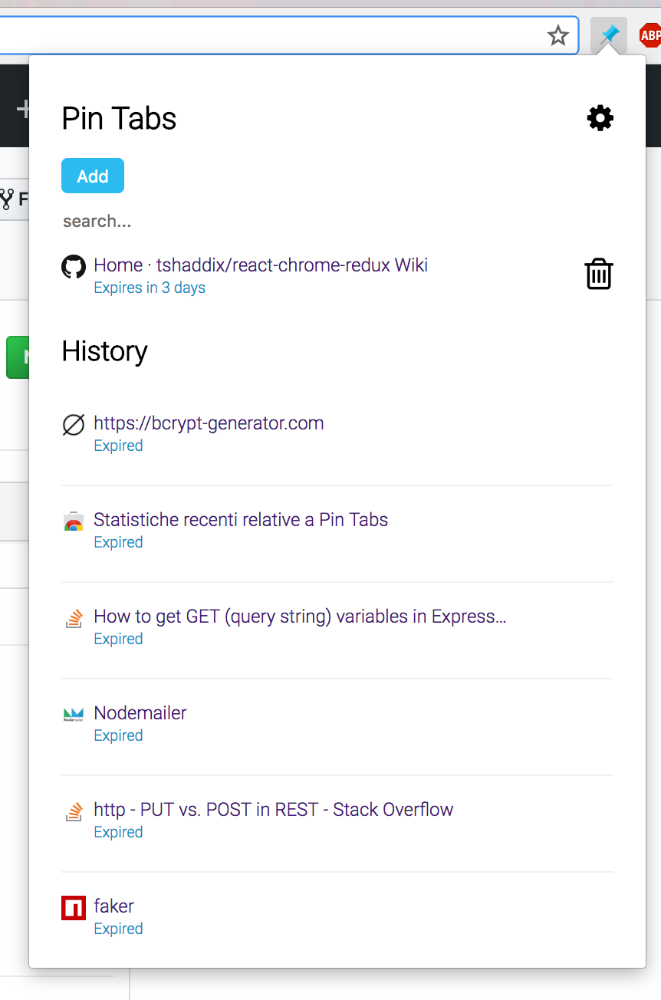
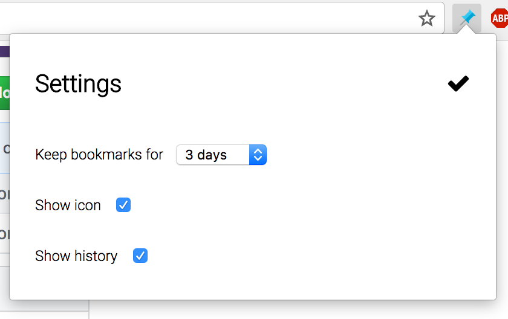

# Pin-Tabs

This extension allows the user to pin browser tabs and keep track of them for short periods of time.
You can add tabs to your favourites either by clicking on the extension's icon, or through a keyboard shortcut (mac: `CTRL + OPT + s`, Windows: `ALT + s`, Linux: `CTRL + ALT + s`). 

Pinned tabs expire after a user-set timing (from 1 hour to 1 week). The last few expired tabs are still accessible through chronology.




## Installation

* Clone the repo and cd into it
* Run ```npm install```
* Run ```npm run build```

## Tech Stack

* [React](https://reactjs.org/)
* [Redux](https://redux.js.org/)
* [React-Chrome-Redux](https://github.com/tshaddix/react-chrome-redux/wiki)

## License

Pin Tabs is licensed under the [MIT](https://opensource.org/licenses/mit-license.php) license.

## Download

Pin Tabs is available in the [Web Store](https://chrome.google.com/webstore/detail/pin-tabs/hhgfkccdcpjigagnmbfehocajjggifam).
